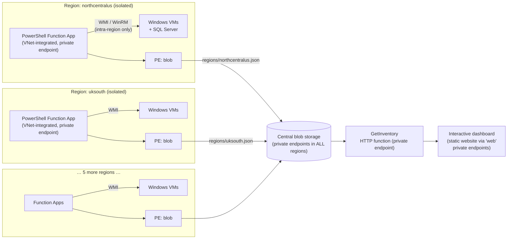

# Azure Server Inventory — OS & SQL Lifecycle Dashboard

A near-real-time, interactive web app that inventories **every Windows server
across your entire Azure environment** — even when firewalls block
region-to-region connectivity — and color-codes each server's lifecycle
status:

| Status | Meaning | Color |
|---|---|---|
| 🔴 **End of life** | Past Microsoft's end of extended support | Red |
| 🟠 **Nearing EOL** | Extended support ends within 12 months (configurable) | Amber |
| 🟢 **Supported** | Inside extended support | Green |
| ⚪ **Unknown** | Caption didn't match a rule, or the server was unreachable | Grey |

The same classification is applied to **SQL Server**: the dashboard shows
whether SQL is installed, every instance's **edition** (Standard, Enterprise,
Express, Developer…), **version/patch level**, and whether that SQL release is
EOL, nearing EOL, or compliant.

All server facts come from **live WMI queries** — the *actual* installed OS
caption (`Win32_OperatingSystem.Caption`), the **physical core count**
(`Win32_Processor.NumberOfCores` summed across sockets), memory, domain, and
SQL Server details read from the registry over WMI (`StdRegProv`) — no agent
and no SQL login required.

## Architecture

The design works *with* your network constraint instead of against it:
regions cannot talk to each other, but **one blob storage account is reachable
from every region** (via a private endpoint in each region), so it becomes the
only cross-region data path. Inventory runs in these seven regions:

`northcentralus` · `eastus2` · `northeurope` · `uksouth` · `southeastasia` ·
`australiaeast` · `brazilsoutheast`



1. **Regional collectors** (`functions/collector/InventoryCollector`) — a
   timer-triggered PowerShell function deployed **once per region**, VNet
   integrated into that region. Every 15 minutes it:
   - discovers the running Windows VMs in *its own region* via `Get-AzVM`
     (managed identity + Reader role — no credentials stored for discovery);
   - opens a parallel CIM/WMI session to each server and queries
     `Win32_OperatingSystem`, `Win32_Processor`, `Win32_ComputerSystem`,
     `Win32_Service` (SQL detection) and `StdRegProv` (SQL edition/version
     from the registry, still over WMI);
   - writes the region snapshot to the central account as
     `inventory/regions/<region>.json`.
2. **Aggregator** (`functions/collector/GetInventory`) — an HTTP function
   (deployed with every app; call any one of them) that merges all region
   blobs into a single JSON feed.
3. **Dashboard** (`dashboard/`) — a dependency-free static web app hosted on
   the storage account's static website. It polls the aggregator every 60
   seconds, classifies each OS and SQL build against the lifecycle tables in
   `dashboard/lifecycle.js`, and renders stat tiles, a per-region status
   breakdown, and a searchable / filterable / sortable server table with CSV
   export. Light and dark mode are both supported.

### Private networking

Everything is private-endpoint only once locked down:

| Traffic | Path |
|---|---|
| Function app inbound (GetInventory, SCM) | Private endpoint per app (`sites`), `privatelink.azurewebsites.net` |
| Collector → central storage | Private endpoint per region (`blob`), `privatelink.blob.core.windows.net` |
| Browser → dashboard static website | Private endpoint per region (`web`), `privatelink.web.core.windows.net` |
| Function app → region's servers | Regional VNet integration (delegated subnet), WMI/WinRM |

The three private DNS zones are created once and linked to every region's
VNet, so the same FQDNs resolve to the local private endpoint everywhere.

Because lifecycle rules live in the dashboard, updating EOL dates (e.g. when
Microsoft publishes Windows Server 2028) is a one-file edit — **no collector
redeployment**.

## Repository layout

```
infra/terraform/
  main.tf               Resource group, central storage, static website,
                        private DNS zones, storage private endpoints
  function_apps.tf      Per-region EP1 plans + function apps + VNet
                        integration + private endpoints + RBAC + zip deploy
  dashboard.tf          Uploads dashboard/ to the $web container
  variables.tf, outputs.tf, versions.tf
  terraform.tfvars.example   The seven regions, ready to fill in
functions/collector/
  InventoryCollector/   Timer trigger: WMI collection -> region blob
  GetInventory/         HTTP trigger: merge region blobs -> dashboard feed
  host.json, profile.ps1, requirements.psd1
dashboard/
  index.html, app.js, styles.css
  lifecycle.js          Windows + SQL EOL tables and classification logic
  config.js             Set apiUrl here; empty = demo mode with sample data
  sample-data.js        Bundled demo snapshot (open index.html locally to try)
scripts/
  Get-AzReservationSavings.ps1   Reservation cost & savings report (see below)
```

## Try it in 10 seconds (no Azure needed)

Open `dashboard/index.html` in a browser. With `config.js` → `apiUrl` left
empty, the dashboard runs on the bundled sample snapshot so you can see the
red/amber/green classification, filters, region bars, and CSV export before
deploying anything.

## Deploying

### Prerequisites

- Terraform ≥ 1.7 and an authenticated `azurerm` context (e.g. `az login`)
  with rights to create resources **and role assignments** (subscription
  Reader is granted to each app's managed identity).
- In **each of the seven regions**:
  - a subnet **delegated to `Microsoft.Web/serverFarms`** for the function
    app's VNet integration (this is how it reaches that region's servers);
  - a subnet for **private endpoints**;
  - the VNet ID (for the private DNS zone links).
- A **WMI service account** with remote WMI/WinRM rights on the target
  servers.
- Regional firewall rules allowing, **within each region only**:
  - Function subnet → servers: TCP 5985/5986 (WinRM; the collector uses
    WSMan by default, set `WMI_TRANSPORT=Dcom` for classic DCOM — that needs
    TCP 135 + dynamic RPC ports).
  - Function subnet → the region's storage `blob` private endpoint: TCP 443.

### Phase 1 — deploy (public deployment path still open)

```bash
cd infra/terraform
cp terraform.tfvars.example terraform.tfvars   # fill in subnet/VNet IDs
export TF_VAR_wmi_password='<service account password>'
terraform init
terraform apply
```

With the default `public_network_access_enabled = true`, Terraform can
zip-deploy the function code and upload the dashboard from your machine while
all private endpoints are already being created.

### Phase 2 — lock down

In `terraform.tfvars` set:

```hcl
public_network_access_enabled = false
```

and `terraform apply` again. Storage and every function app now refuse public
traffic; everything flows through the private endpoints. From this point,
applies that push new code or dashboard content must run from a machine or
pipeline agent with private connectivity to those endpoints.

### Wire up the dashboard

1. Get a **function key** for `GetInventory` from any one of the apps and set
   the full URL in `dashboard/config.js`:
   ```js
   apiUrl: "https://srvinv-func-eastus2.azurewebsites.net/api/GetInventory?code=<key>"
   ```
   (The hostname resolves to the private endpoint from linked VNets.)
   Re-apply Terraform — `dashboard.tf` detects the content change and
   re-uploads the file.
2. **Move `WMI_PASSWORD` to Key Vault**: create a secret, grant each app's
   managed identity *Key Vault Secrets User*, and change the app setting to
   `@Microsoft.KeyVault(SecretUri=https://<vault>.vault.azure.net/secrets/wmi-password/)`
   — the Terraform config ignores drift on that setting so your change
   sticks.
3. Tighten `Access-Control-Allow-Origin` in `GetInventory/run.ps1` to the
   dashboard's URL.

## Configuration reference (collector app settings)

| Setting | Purpose | Default |
|---|---|---|
| `INVENTORY_REGION` | The one region this app inventories | set by Terraform |
| `INVENTORY_STORAGE_ACCOUNT` | Central storage account name | set by Terraform |
| `INVENTORY_CONTAINER` | Blob container | `inventory` |
| `WMI_USERNAME` / `WMI_PASSWORD` | Remote WMI credentials | set by Terraform |
| `WMI_TRANSPORT` | `Wsman` or `Dcom` | `Wsman` |
| `COLLECTOR_THROTTLE` | Parallel WMI sessions | `8` |

Collection cadence is the timer CRON in
`InventoryCollector/function.json` (default every 15 minutes); dashboard poll
interval is `refreshSeconds` in `dashboard/config.js` (default 60 s).

## Lifecycle data

End-of-extended-support dates ship in `dashboard/lifecycle.js` for Windows
Server 2003 → 2025 and SQL Server 2000 → 2022, with SQL versions mapped from
the registry build number (e.g. `15.x` → SQL Server 2019). "Nearing EOL"
means within `NEARING_MONTHS` (12) months of the date. ESU coverage is
deliberately ignored — an ESU server still shows red so it stays on your
migration list. Verify dates against
[Microsoft Lifecycle](https://learn.microsoft.com/lifecycle/) when updating.

## Reservation cost & savings report

`scripts/Get-AzReservationSavings.ps1` is a standalone report — it needs
nothing from the dashboard or the function apps. Dot-source it and run:

```powershell
Connect-AzAccount
. ./scripts/Get-AzReservationSavings.ps1
Show-AzReservationSavings
```

```
Name              Sku              Region      Qty Term Cost/mo (USD) PAYG/mo (USD) Saving/mo (USD) Saving % Util % Mo left Source
----              ---              ------      --- ---- ------------- ------------- --------------- -------- ------ ------- ------
prod-d4sv3-eastus Standard_D4s_v3  eastus       10 P3Y       1,015.60      1,401.60          386.00     27.5   97.2      18 CostManagement
dev-e8sv5-weu     Standard_E8s_v5  westeurope    4 P1Y         966.67      1,471.68          505.01     34.3   35.0       5 Retail

  Reservation cost / month                  1,982.27 USD
  Pay-as-you-go equivalent                  2,873.28 USD
  Projected saving / month                    891.01 USD
  Projected saving / year                  10,692.12 USD
  Realized at current utilization             439.43 USD
```

`Get-AzReservationSavings` emits one object per reservation, so the data is
yours to slice — `Export-Csv`, `ConvertTo-Json`, `Where-Object`, whatever:

```powershell
Get-AzReservationSavings | Sort-Object MonthlySaving | Select-Object -First 10
Get-AzReservationSavings -CostScope '/providers/Microsoft.Billing/billingAccounts/1234567' |
    Export-Csv ./reservation-savings.csv -NoTypeInformation
```

### Where the numbers come from

**Monthly cost** resolves from the best source available, and every row
records which one won in its `CostSource` property:

| Source | What it is | Requires |
|---|---|---|
| `CostManagement` | Actual amortized cost billed last complete month, grouped by `ReservationId` — reflects *your* prices | Cost Management Reader on an EA/MCA billing scope |
| `BillingPlan` | The real recurring payment, for reservations bought on the monthly plan | Reservation Reader |
| `Retail` | Public list price for the term, divided across it | nothing (public API) |

**Pay-as-you-go comparison** always comes from the public Azure Retail Prices
API. For VMs the *base* compute rate is used — Linux, non-Spot — because a
reservation discounts compute only, never the Windows or SQL licence on top
of it. Comparing against the Windows rate would overstate savings.

**Projected vs realized.** `MonthlySaving` is what the reservation earns if
fully used. `RealizedMonthlySaving` scales the pay-as-you-go side by actual
utilization, so an under-used reservation shows what it is *really* returning
— and goes negative when it costs more than the usage it covers. Anything
below 90% utilization is called out separately under the totals.

### Caveats worth knowing

- **Non-VM reservations** (Cosmos DB, SQL vCore, App Service, Databricks…)
  often have no `armSkuName` in the retail catalogue. Those rows report the
  reservation and its cost but leave the savings columns empty with a note,
  rather than guessing at a match.
- **Retail rows are list price.** If you have an EA/MCA discount, the
  `Retail` source understates your saving. Pass `-CostScope` with a billing
  account to get `CostManagement` numbers instead.
- **Instance size flexibility** means a reservation may be covering sizes
  other than its own SKU. The pay-as-you-go comparison uses the reservation's
  own SKU, which is the standard method, but the realized figure is the one
  to trust when flexibility is on.
- The current month is always partial, so the default billing month is the
  **last complete calendar month**. Override with `-CostMonth`.
- Savings assume **730 hours/month** (Azure's own convention); override with
  `-HoursPerMonth`.

Run `Get-Help Get-AzReservationSavings -Full` for every parameter.

## Notes & extension points

- **Non-Azure / Arc servers**: add discovery via `Get-AzConnectedMachine`
  (Azure Arc) in the collector, or feed a static target list per region.
- **Linux servers**: WMI is Windows-only; a parallel collector over SSH could
  emit the same JSON shape and the dashboard would render it unchanged.
- **Scale**: at hundreds of servers per region, raise `COLLECTOR_THROTTLE`,
  the `functionTimeout` in `host.json`, or split the region across multiple
  timer schedules.
- **SQL clusters/AGs**: detection is per-node (service + registry), which is
  usually what licensing and patching reviews want.
- **Dashboard auth**: the static website is network-restricted by the private
  endpoints; add Entra ID (e.g. Front Door + Easy Auth or an internal reverse
  proxy) if you also need identity-based access control.
