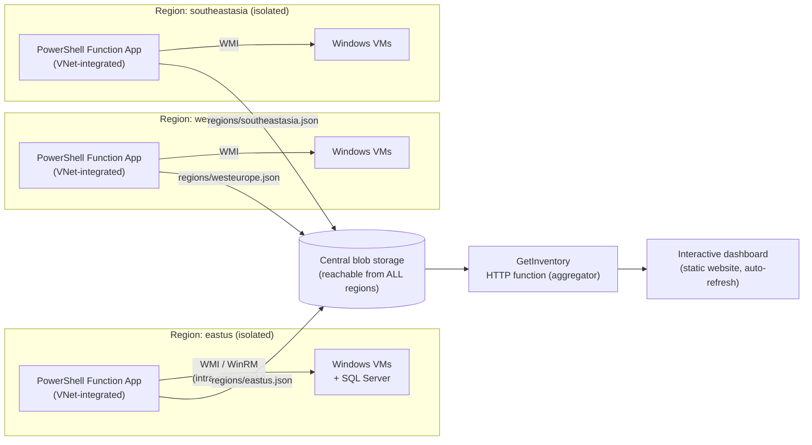

# Azure Server Inventory — OS & SQL Lifecycle Dashboard

A near-real-time, interactive web app that inventories **every Windows server
across your entire Azure environment** — even when firewalls block
region-to-region connectivity — and color-codes each server's lifecycle
status:

| Status | Meaning | Color |
|---|---|---|
| 🔴 **End of life** | Past Microsoft's end of extended support | Red |
| 🟠 **Nearing EOL** | Extended support ends within 12 months (configurable) | Amber |
| 🟢 **Supported** | Inside extended support | Green |
| ⚪ **Unknown** | Caption didn't match a rule, or the server was unreachable | Grey |

The same classification is applied to **SQL Server**: the dashboard shows
whether SQL is installed, every instance's **edition** (Standard, Enterprise,
Express, Developer…), **version/patch level**, and whether that SQL release is
EOL, nearing EOL, or compliant.

All server facts come from **live WMI queries** — the *actual* installed OS
caption (`Win32_OperatingSystem.Caption`), the **physical core count**
(`Win32_Processor.NumberOfCores` summed across sockets), memory, domain, and
SQL Server details read from the registry over WMI (`StdRegProv`) — no agent
and no SQL login required.

## Architecture

The design works *with* your network constraint instead of against it:
regions cannot talk to each other, but **one blob storage account is reachable
from every region**, so it becomes the only cross-region data path.



1. **Regional collectors** (`functions/collector/InventoryCollector`) — a
   timer-triggered PowerShell function deployed **once per region**, VNet
   integrated into that region. Every 15 minutes it:
   - discovers the running Windows VMs in *its own region* via `Get-AzVM`
     (managed identity + Reader role — no credentials stored for discovery);
   - opens a parallel CIM/WMI session to each server and queries
     `Win32_OperatingSystem`, `Win32_Processor`, `Win32_ComputerSystem`,
     `Win32_Service` (SQL detection) and `StdRegProv` (SQL edition/version
     from the registry, still over WMI);
   - writes the region snapshot to the central account as
     `inventory/regions/<region>.json`.
2. **Aggregator** (`functions/collector/GetInventory`) — an HTTP function
   (deployed with every app; call any one of them) that merges all region
   blobs into a single JSON feed.
3. **Dashboard** (`dashboard/`) — a dependency-free static web app hosted on
   the storage account's static website. It polls the aggregator every 60
   seconds, classifies each OS and SQL build against the lifecycle tables in
   `dashboard/lifecycle.js`, and renders stat tiles, a per-region status
   breakdown, and a searchable / filterable / sortable server table with CSV
   export. Light and dark mode are both supported.

Because lifecycle rules live in the dashboard, updating EOL dates (e.g. when
Microsoft publishes Windows Server 2028) is a one-file edit — **no collector
redeployment**.

## Repository layout

```
infra/
  main.bicep            Central storage + per-region EP1 function apps + RBAC
  deploy.ps1            One-shot deployment (infra, code, roles, dashboard)
functions/collector/
  InventoryCollector/   Timer trigger: WMI collection -> region blob
  GetInventory/         HTTP trigger: merge region blobs -> dashboard feed
  host.json, profile.ps1, requirements.psd1
dashboard/
  index.html, app.js, styles.css
  lifecycle.js          Windows + SQL EOL tables and classification logic
  config.js             Set apiUrl here; empty = demo mode with sample data
  sample-data.js        Bundled demo snapshot (open index.html locally to try)
```

## Try it in 10 seconds (no Azure needed)

Open `dashboard/index.html` in a browser. With `config.js` → `apiUrl` left
empty, the dashboard runs on the bundled sample snapshot so you can see the
red/amber/green classification, filters, region bars, and CSV export before
deploying anything.

## Deploying

### Prerequisites

- Az PowerShell modules (`Az.Resources`, `Az.Websites`, `Az.Storage`), signed
  in with rights to create resources and role assignments.
- **One subnet per region**, delegated to `Microsoft.Web/serverFarms`, for the
  function apps' VNet integration (this is how each app reaches its region's
  servers behind the firewall).
- A **WMI service account** with remote WMI/WinRM rights on the target servers
  (typically a domain account in the local Administrators group, or a
  hardened least-privilege WMI account).
- Regional firewall rules allowing, **within each region only**:
  - Function subnet → servers: TCP 5985/5986 (WinRM; the collector uses
    WSMan by default, set `WMI_TRANSPORT=Dcom` to use classic DCOM instead —
    that needs TCP 135 + dynamic RPC ports).
  - Function subnet → central storage account: HTTPS 443 (or a private
    endpoint for the storage account inside each regional VNet).

### Deploy

```powershell
./infra/deploy.ps1 `
    -ResourceGroupName rg-server-inventory `
    -NamePrefix srvinv `
    -HubLocation eastus `
    -Regions @(
        @{ name = 'eastus';     subnetId = '<subnet resource id in eastus>' }
        @{ name = 'westeurope'; subnetId = '<subnet resource id in westeurope>' }
    ) `
    -WmiUsername 'CORP\svc-inventory'
```

Then:

1. In the portal, copy a **function key** for `GetInventory` from any one of
   the apps and set the full URL in `dashboard/config.js`:
   ```js
   apiUrl: "https://srvinv-func-eastus.azurewebsites.net/api/GetInventory?code=<key>"
   ```
   Re-upload `config.js` to the `$web` container (or re-run the script).
2. **Move `WMI_PASSWORD` to Key Vault**: create a secret, grant each app's
   managed identity *Key Vault Secrets User*, and change the app setting to
   `@Microsoft.KeyVault(SecretUri=https://<vault>.vault.azure.net/secrets/wmi-password/)`.
3. Tighten `Access-Control-Allow-Origin` in `GetInventory/run.ps1` to your
   dashboard's URL, and consider putting Entra ID auth (Easy Auth) in front
   of both the function and the static site.

## Configuration reference (collector app settings)

| Setting | Purpose | Default |
|---|---|---|
| `INVENTORY_REGION` | The one region this app inventories | — (required) |
| `INVENTORY_STORAGE_ACCOUNT` | Central storage account name | — (required) |
| `INVENTORY_CONTAINER` | Blob container | `inventory` |
| `WMI_USERNAME` / `WMI_PASSWORD` | Remote WMI credentials | — (required) |
| `WMI_TRANSPORT` | `Wsman` or `Dcom` | `Wsman` |
| `COLLECTOR_THROTTLE` | Parallel WMI sessions | `8` |

Collection cadence is the timer CRON in
`InventoryCollector/function.json` (default every 15 minutes); dashboard poll
interval is `refreshSeconds` in `dashboard/config.js` (default 60 s).

## Lifecycle data

End-of-extended-support dates ship in `dashboard/lifecycle.js` for Windows
Server 2003 → 2025 and SQL Server 2000 → 2022, with SQL versions mapped from
the registry build number (e.g. `15.x` → SQL Server 2019). "Nearing EOL"
means within `NEARING_MONTHS` (12) months of the date. ESU coverage is
deliberately ignored — an ESU server still shows red so it stays on your
migration list. Verify dates against
[Microsoft Lifecycle](https://learn.microsoft.com/lifecycle/) when updating.

## Notes & extension points

- **Non-Azure / Arc servers**: add discovery via `Get-AzConnectedMachine`
  (Azure Arc) in the collector, or feed a static target list per region.
- **Linux servers**: WMI is Windows-only; a parallel collector over SSH could
  emit the same JSON shape and the dashboard would render it unchanged.
- **Scale**: at hundreds of servers per region, raise `COLLECTOR_THROTTLE`,
  the `functionTimeout` in `host.json`, or split the region across multiple
  timer schedules.
- **SQL clusters/AGs**: detection is per-node (service + registry), which is
  usually what licensing and patching reviews want.
